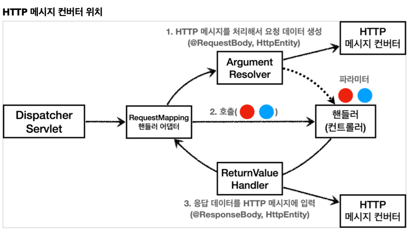
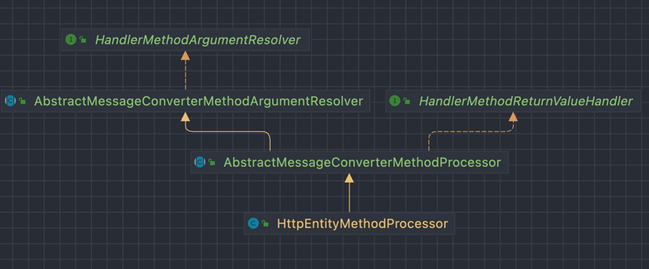
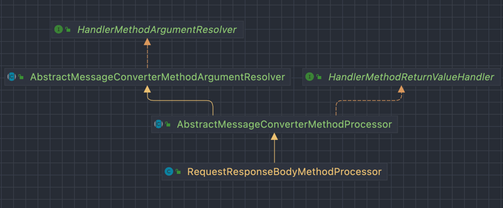

# spring-mvc-basic

---

### HTTP 메시지 컨버터

````java
public interface HttpMessageConverter<T> {
	boolean canRead(Class<?> clazz, @Nullable MediaType mediaType);
	boolean canWrite(Class<?> clazz, @Nullable MediaType mediaType);

	List<MediaType> getSupportedMediaTypes();
    
	default List<MediaType> getSupportedMediaTypes(Class<?> clazz) {
		return (canRead(clazz, null) || canWrite(clazz, null) ?
				getSupportedMediaTypes() : Collections.emptyList());
	}
    
	T read(Class<? extends T> clazz, HttpInputMessage inputMessage) 
            throws IOException, HttpMessageNotReadableException;

	void write(T t, @Nullable MediaType contentType, HttpOutputMessage outputMessage) 
            throws IOException, HttpMessageNotWritableException;

}

````

- HTTP 메시지 컨버터는 HTTP 요청과 응답 두 곳에서 모두 사용된다.
- canRead(), canWrite()
  - 메시지 컨버터가 해당 클래스 혹은 미디어타입을 지원하는지 체크한다.
- read(), write() 
  - 메시지 컨버터를 통해서 메시지를 읽고 쓰는 기능을 한다.
  
<br>

#### 스프링 부트의 기본 메시지 컨버터

스프링 부트는 다양한 메시지 컨버터를 제공하는데, 대상 클래스 타입과 미디어 타입을 체크해서 사용여부를 결정한다. 만약 조건에 맞지 않다면 다음 메시지 컨버터로 우선순위가 넘어간다.

> xxxHttpMessageConverter.canRead() = false => next converter
> xxxHttpMessageConverter.canWrite() = false => next converter

0. ByteArrayHttpMessageConverter 
   - class type : byte[]
   - media type : \*/*
   - 요청 예) @RequestBody byte[] data
   - 응답 예) @ResponseBody return byte[] 
   - 쓰기 미디어 타입 : application/octet-stream 
1. StringHttpMessageConverter
   - class type : String
   - media type : \*/*
   - 요청 예) @RequestBody String data
   - 응답 예) @ResponseBody return "ok"
   - 쓰기 미디어 타입 : text/plain
2. MappingJackson2HttpMessageConverter
   - class type : object or HashMap
   - media type : application/json
   - 요청 예) @RequestBody HelloData data
   - 응답 예) @ResponseBody return new HelloData()
   - 쓰기 미디어 타입 : application/json  

... 등등


---

### ArgumentResolver
> 애노테이션 기반의 컨트롤러에서 매우 다양한 파라미터를 사용할 수 있는데 이 다양한 파라미터를 생성해주는 책임을 맡은 곳이 <b>ArgumentResolver</b> 이다.

애노테이션 기반의 컨트롤러를 처리하는 RequestMappingHandlerAdaptor 는 <b>ArgumentResolver</b> 를 호출해서 컨트롤러(즉 핸들러)가 필요로 하는 다양한 파라미터의 값(객체)를 생성한다. 그리고 이렇게 파라미터의 값이 모두 준비되면 컨트롤러를 호출하면서 값을 넘겨준다.

  
[출처 : (인프런) 스프링 MVC 1편 - 김영한](https://www.inflearn.com/course/%EC%8A%A4%ED%94%84%EB%A7%81-mvc-1)


* 스프링은 30개가 넘는 ArgumentResolver 를 기본으로 제공한다.

#### ArgumentResolver 살펴보기

다형성을 잘 활용한 ArgumentResolver 의 인터페이스 내부 구조

```java
public interface HandlerMethodArgumentResolver {

	/**
	 * Whether the given {@linkplain MethodParameter method parameter} is
	 * supported by this resolver.
	 * @param parameter the method parameter to check
	 * @return {@code true} if this resolver supports the supplied parameter;
	 * {@code false} otherwise
	 */
	boolean supportsParameter(MethodParameter parameter);

	/**
	 * Resolves a method parameter into an argument value from a given request.
	 * A {@link ModelAndViewContainer} provides access to the model for the
	 * request. A {@link WebDataBinderFactory} provides a way to create
	 * a {@link WebDataBinder} instance when needed for data binding and
	 * type conversion purposes.
	 * @param parameter the method parameter to resolve. This parameter must
	 * have previously been passed to {@link #supportsParameter} which must
	 * have returned {@code true}.
	 * @param mavContainer the ModelAndViewContainer for the current request
	 * @param webRequest the current request
	 * @param binderFactory a factory for creating {@link WebDataBinder} instances
	 * @return the resolved argument value, or {@code null} if not resolvable
	 * @throws Exception in case of errors with the preparation of argument values
	 */
	@Nullable
	Object resolveArgument(MethodParameter parameter, @Nullable ModelAndViewContainer mavContainer,
			NativeWebRequest webRequest, @Nullable WebDataBinderFactory binderFactory) throws Exception;

}
```

  
### ReturnValueHandler
> @ResponseBody, String, HttpEntity 등 반환 값에 대한 컨버팅 작업을 해준다. 

- ArgumentResolver 와 비슷한 구조를 갖고 있다.

### HTTP 메시지 컨버터



ArgumentResolver 들이 HTTP 메시지 컨버터를 사용해서 필요한 객체를 생성한다.  

@RequestBody, @ResponseBody 가 있으면 RequestResponseBodyMethodProcessor 가 동작한다.




